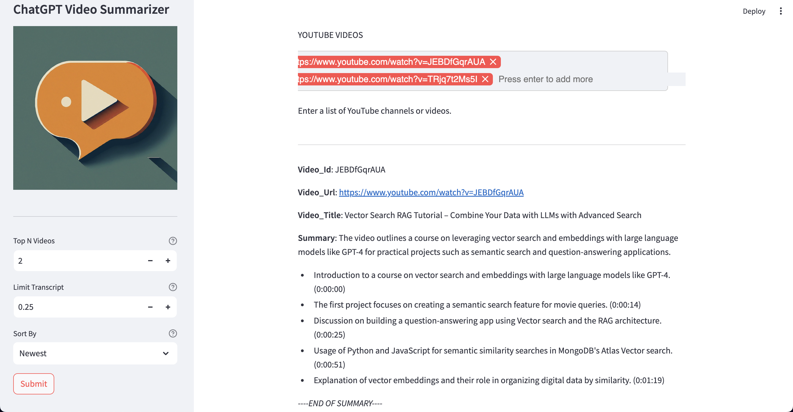

# Jasper, Video Summarizer
## About
Jasper uses ChatGPT to summarise a YouTube video by providing either a YouTube channel or the video link.

It will provide a brief 150 word summary of the video as well as the top 5 main points in the video.
The main points are timestamped so that it's easy to navigate the video where
the conversation is taking place. 

This tool allows one to determine whether to summarise the entire video or
a portion of the video.

## Installation
- Clone this repo
- Set up Mongodb:
  - Create `admin` user with `readWrite` access
  - Create a database with two collections
- Set up Python in a vitual environment and install the Poetry Python package
- Install packages: `poetry install`

## Mongodb setup
### Creating a Mongodb database and user
```
mongosh
show dbs
use video_summarizer
db.createUser(
  {
    user: "admin",
    pwd: passwordPrompt(),  // or cleartext password
    roles: [
       { role: "readWrite", db: "test" },
       { role: "readWrite", db: "video_summarizer" }
    ]
  }
)
show users
```
### Querying a collection
```
use video_summarizer
show collections
db.createCollection("transcripts")
db.createCollection("summaries")
db.summaries.countDocuments()
db.summaries.find().limit(2)
db.summaries.find( { video_id: 'JEBDfGqrAUA' } )
db.summaries.find( { _id: ObjectId('65c9065f25cc20f6dbde287e') } )
db.summaries.insertOne( { item: "card", qty: 15 } )
db.summaries.deleteMany( { video_id: 'IUTFrexghsQ'  } )
```

## Usage
### DockerHub
- Run: `docker pull --platform=linux/arm64 johnmwangi/chatgpt-video-summarizer:latest`

### Local development
- Run FastAPI backend: `uvicorn api:app --host 0.0.0.0 --port 12000 --reload`
- Run Streamlit frontend: `streamlit run ui.py`
- Access Swagger docs: `http://0.0.0.0:12000/docs`
- Click the lock icon to add credentials before calling the `/summarize_video` endpoint

### Local Docker
- Create a `docker.env` with your credentials at the root of the project
- Run the Docker container: `docker run --env-file ./docker.env -p 8501:8501 -p 12000:12000 video_summarizer`
- Access the app: `http://0.0.0.0:8501/`
- Enter a channel url or video url to the api
- Video summaries will be saved in the database and display on the app

### Running tests
* tests: `pytest -vs`
* coverage report: `pytest --cov --cov-report=html`

## Web App

